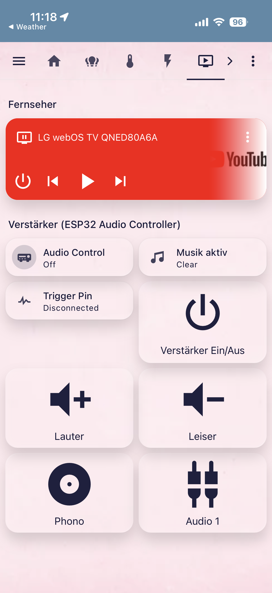
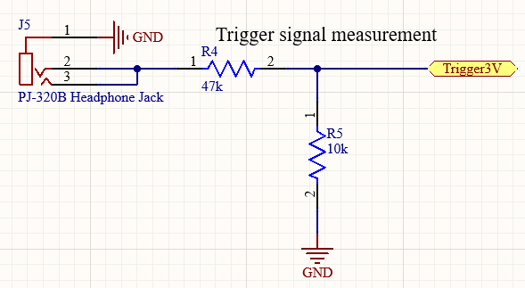
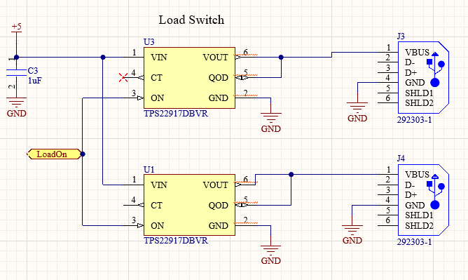
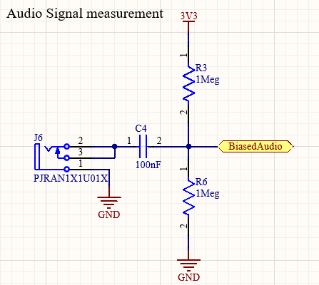

# SchaltMichAus

**SchaltMichAus** is a smart add-on for my audio setup (Yamaha RX-V1065), now built around **Home Assistant** as the primary control layer via **MQTT**.
It monitors the receiver's activity, exposes trigger/music state as Home Assistant entities, and automatically shuts down the receiver via IR when no audio is playing.

**Goal:**
Reduce energy consumption, avoid unnecessary idle time, and extend the lifetime of the receiver – fully integrated into my smart home, without changing how the setup is normally used.

## Motivation

I inherited a Yamaha RX-V1065 from my grandpa.
Whenever someone in the flat listened to music in the evening, we often forgot to turn the amplifier off. Managing the peripherals manually or switching the TV audio output every time was inconvenient. I wanted a solution that:

- does not change how the receiver is used,
- requires no firmware or hardware modifications to the receiver itself,
- integrates cleanly into Home Assistant,
- and keeps the device as my grandpa left it.

## Features

- **Home Assistant integration (MQTT)**
  - ESP32 publishes trigger state, music-active state, and switch state via MQTT with HA Discovery – all entities show up automatically in Home Assistant, no manual YAML config needed.
  - A dedicated switch entity lets me manually trigger a shutdown from HA, alongside automations (e.g. tied to presence, time of day, or other smart home logic).
  - This is now the main way the system is operated day-to-day.

- **Automatic idle detection**
  - Monitors the receiver's 12 V trigger output.
  - Analyzes the audio-out signal to detect real audio activity.
  - Marks the system as "inactive" after a configurable silence timeout.

- **Input Switching and Volume Control**
  - Can switch between Inputs for Record Player (Phono) and TV (Audio1).
  - With Home Assistant Automations, the Input gets automatically set for the TV and in the Future maybe even for the record player with an DIY sensor when i open the record player.
  - Volume can be controlled with Home Assistant.

Simple Voltage Divider

$U_m=12V*{10k\Omega \above{2pt} 10k\Omega+47k\Omega} \approx 2.1V$

- **Automatic receiver power-down – hardware fallback**
  - Independently of Home Assistant, the ESP32 itself tracks a **20-minute silence timeout**: if no music activity is detected for 20 minutes, it sends IR commands to the receiver for a clean shutdown – just like a remote.
  - This runs locally on the ESP32 regardless of whether HA, MQTT, or WiFi are available, so the amp still gets shut off even if the smart home stack is down.

- **Load switch (present on PCB, currently unused)**
  - The custom PCB still includes a load switch, originally used to power down the ARC extractor and other peripherals.
  - Since the ARC extractor is no longer part of the setup (audio now goes via Bluetooth), the load switch is not currently used in this use case, but remains available on the board for future peripherals if needed.

Load Switches parallel so the current is less of a problem. We only need Power so D- and D+ are left floating.

- **Non-intrusive integration**
  - Installed between the receiver's audio/trigger outputs and the peripherals.
  - Requires no modification of the receiver.
  - Works completely in the background.

- **Smart audio detection**
  - Uses a DC-biased input and statistical deviation ("loudness over time") to detect meaningful audio.
  - Avoids false shutdowns during quiet passages or short pauses.

Audio Signal is biased to $3.3V / 2 =1.65V$ because IO Pin cant handle negative Voltage

- **Bluetooth audio path (replaces ARC extractor)**
  - The previous ARC extractor is no longer used.
  - The TV now sends its audio directly to the receiver over **Bluetooth**, simplifying the signal chain and removing the extra ARC hardware step entirely.

## Typical Use Case

1. TV audio is streamed to the receiver via Bluetooth (or another source is played, e.g. turntable via phono).
2. SchaltMichAus detects the active state via the trigger signal and begins monitoring audio.
3. Trigger and music state are visible live in Home Assistant, and I can control shutdown manually or via HA automations.
4. During playback, the receiver stays on; ESP32 and Bluetooth module run continuously in the background regardless.
5. After playback stops:
   - If controlled via Home Assistant, automations can react to the published state as configured.
   - Independently, after the configured silence interval (20 min) passes with no music detected, the receiver is turned off via IR – this happens regardless of HA availability.

**Result:**
No more receiver running for hours after someone forgot to turn it off, now with full Home Assistant visibility and control on top of the standalone hardware safety net.

## Hardware Overview

- **Controller:** ESP32 (AZ-Delivery version)
- **Inputs:**
  - 5 V via USB-C
  - 12 V trigger input
  - Audio-out signal (approx. ±1 V)
- **Outputs:**
  - IR LED for power commands to the receiver
  - Load switch (on PCB, currently unused – previously powered ARC extractor)
- **Connectivity:**
  - MQTT to Home Assistant, with HA Discovery for switch, trigger, and music-active entities
  - Bluetooth receiver module (TV → receiver audio path), running continuously

## Status

- Home Assistant / MQTT integration: **working**
- IR on/off control: **working**
- Trigger signal monitoring: **working**
- Audio-based idle detection: **working**
- 20-minute hardware silence shutdown (independent of HA): **working**
- Bluetooth audio path (TV → receiver): **working**
- Custom PCB with ESP32, audio and trigger inputs, load switch: **working** (load switch currently unused in this setup)

## Initial Problems

- The first ESP32 unit was unreliable, causing inconsistent behaviour → resolved by replacing it.
- Audio detection pin was not ADC-capable → fixed by soldering a jumper wire to a valid ADC pin.
